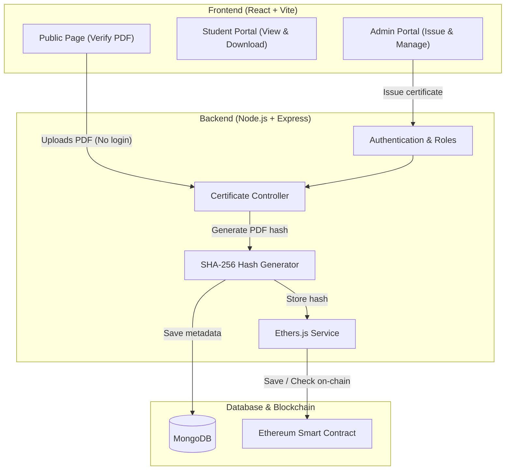

# CertiChain
### Blockchain-Based PDF Certificate Issuance and Verification System

[](https://soliditylang.org/)
[](https://ethereum.org/)
[](https://nodejs.org/)
[](https://expressjs.com/)
[](https://react.dev/)
[](https://tailwindcss.com/)

CertiChain is a full-stack application that helps schools and universities issue digital certificates that cannot be forged or modified. 

When a certificate PDF is created, the system calculates its unique SHA-256 digital fingerprint and saves that hash on the Ethereum blockchain. Certificate details and metadata are stored in MongoDB.

Anyone can verify a certificate by simply uploading the PDF file. The system checks the file's hash against the blockchain record. Verifiers do not need an account, password, or certificate ID to check authenticity.

---

## Key Features

- **Document Integrity Check**:
  - The system creates a unique SHA-256 hash from the exact content of the PDF.
  - This hash is saved directly on the Ethereum blockchain.
  - If someone edits even a single number, name, or grade in the PDF, the file produces a different hash and verification fails.

- **Instant Public Verification**:
  - Users can verify credentials directly on the `/verify` page by uploading the PDF.
  - No login, registration, or manual certificate ID input is needed.

- **Role-Based Access**:
  - **Admin**: Issues new certificates, manages existing records, and views overall stats.
  - **Student**: Logs in to view and download their official certificate PDF with an embedded QR code.
  - **Public**: Verifies any certificate file quickly and anonymously.

- **PDF and QR Code Generation**:
  - Creates certificates with student information and adds a QR code for direct verification.

- **Automatic Database Setup**:
  - Uses an in-memory MongoDB fallback if a local MongoDB server is not running, allowing quick setup for development and testing.

---

## How It Works



---

## Tech Stack

- **Smart Contract**: Solidity (`0.8.20`), Ethers.js (`v6`), Hardhat
- **Backend**: Node.js, Express.js, MongoDB (Mongoose), Multer, PDFKit, QRCode, JWT, bcryptjs
- **Frontend**: React 18, Vite, TailwindCSS, React Router v6, Axios, Lucide Icons

---

## Project Structure

```
blockchain-certificate-verification/
├── contracts/
│   └── CertificateVerification.sol   # Solidity Smart Contract
├── backend/
│   ├── config/
│   │   ├── db.js                     # Database connection & memory fallback
│   │   ├── ethereum.js               # Blockchain connection setup
│   │   └── contractDetails.json      # Contract ABI and address
│   ├── controllers/
│   │   ├── authController.js         # User registration and login
│   │   └── certificateController.js  # Issue, verify, download, and QR routes
│   ├── middleware/                   # Authentication and input validation
│   ├── models/                       # User and Certificate schemas
│   ├── routes/                       # API endpoints
│   ├── services/                     # Blockchain & hashing logic
│   ├── server.js                     # Backend entry point
│   └── .env                          # Backend settings
├── frontend/
│   ├── src/
│   │   ├── components/               # Reusable UI elements
│   │   ├── pages/                    # Verify, Issue, Dashboard, and Login pages
│   │   ├── services/                 # API client calls
│   │   └── App.jsx                   # Routing setup
│   ├── tailwind.config.js            # Design settings
│   └── vite.config.js                # Frontend build setup
└── README.md
```

---

## Getting Started

### Prerequisites
- Node.js (v18 or higher)
- npm or yarn
- Git

---

### Step 1: Smart Contract Setup

If testing on a local Ethereum network using Hardhat:

```bash
# Compile the smart contract
npx hardhat compile

# Start local blockchain node (Terminal 1)
npx hardhat node

# Deploy contract to local network (Terminal 2)
npx hardhat run scripts/deploy.js --network localhost
```

Copy the deployed contract address into your backend `.env` file or `backend/config/contractDetails.json`.

---

### Step 2: Backend Setup

1. Open a terminal and enter the backend directory:
   ```bash
   cd backend
   npm install
   ```

2. Create or update your `backend/.env` file with these values:
   ```env
   PORT=5000
   NODE_ENV=development
   JWT_SECRET=your_jwt_secret_key
   MONGO_URI=mongodb://127.0.0.1:27017/blockchain_certificate_db
   RPC_URL=https://ethereum-sepolia-rpc.publicnode.com
   ISSUER_PRIVATE_KEY=your_private_key
   CONTRACT_ADDRESS=your_deployed_contract_address
   ```
   *Note: If local MongoDB is not installed or running, the backend will automatically start an in-memory database.*

3. Start the backend server:
   ```bash
   npm run dev
   ```
   The backend will start at `http://localhost:5000`.

---

### Step 3: Frontend Setup

1. Open another terminal and enter the frontend directory:
   ```bash
   cd frontend
   npm install
   ```

2. Start the development server:
   ```bash
   npm run dev
   ```
   The frontend will run at `http://localhost:5173`.

---

## How to Test

1. **Verify a Certificate (Public)**:
   - Go to `http://localhost:5173/verify`.
   - Upload any issued certificate PDF.
   - The app reads the PDF hash and checks it against the smart contract.
   - You will see the verification result along with student details and the issue date.

2. **Issue a Certificate (Admin)**:
   - Log in with an admin account.
   - Go to `/issue`.
   - Enter student details and upload or generate the certificate.
   - Submit the form to record the certificate hash on the blockchain.

3. **Test Tamper Detection**:
   - Open a valid certificate PDF in any editor.
   - Change a single letter or number and save the file.
   - Upload the edited PDF to `/verify`.
   - The system will detect the altered hash and mark the certificate as invalid.

---

## Security Details

- **Cryptographic Hashing**: SHA-256 creates a unique fingerprint for each document, preventing duplicates and forgery.
- **Efficient Gas Usage**: Only the 32-byte hash is stored on-chain, keeping transaction fees low while maintaining verification security.
- **Protected Actions**: Issuing and updating certificates require an authenticated admin account.
