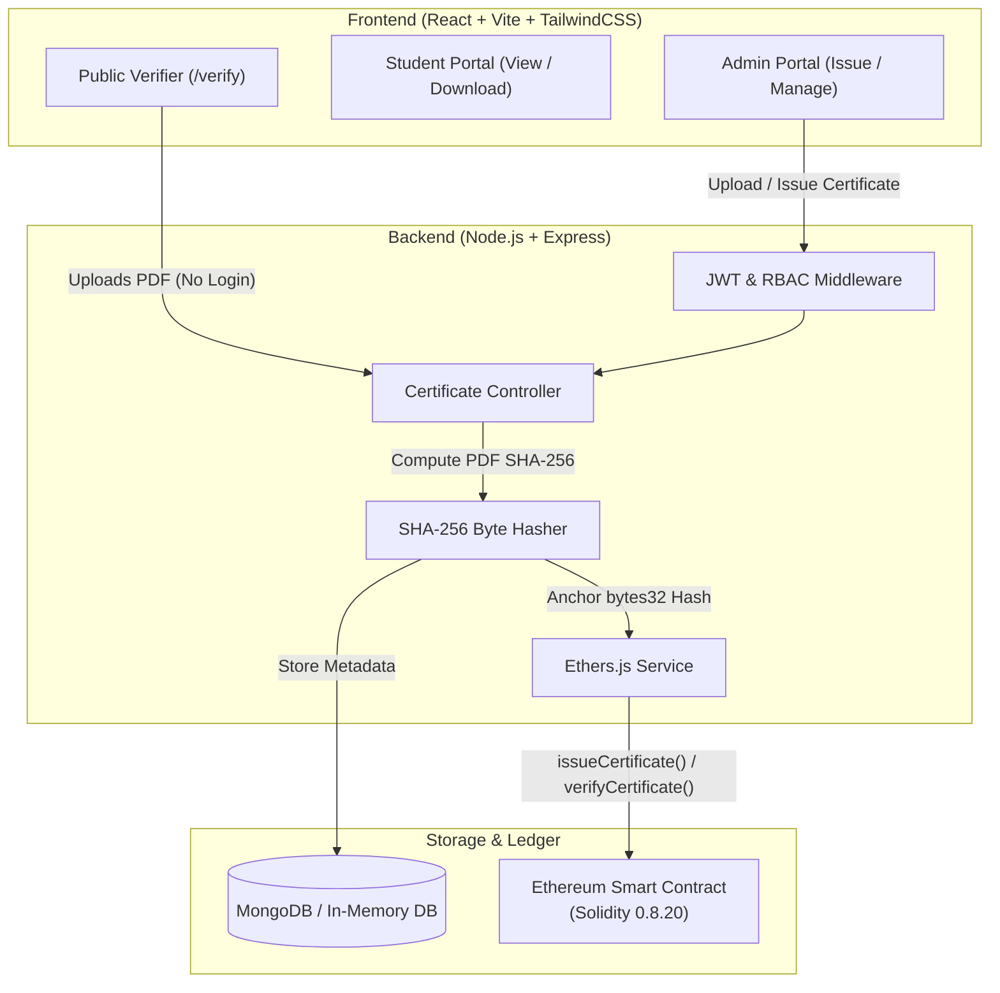

# CertiChain 🎓⛓️
### Blockchain-Based PDF Certificate Issuance & Verification System

[](https://soliditylang.org/)
[](https://ethereum.org/)
[](https://nodejs.org/)
[](https://expressjs.com/)
[](https://react.dev/)
[](https://tailwindcss.com/)
[](https://opensource.org/licenses/MIT)

A tamper-proof, full-stack decentralized application (dApp) enabling educational institutions and certifying bodies to issue cryptographically verifiable digital certificates. Original certificate PDF documents are hashed using **SHA-256** and anchored directly to the **Ethereum blockchain** via Solidity smart contracts, paired with off-chain metadata storage and automatic fallback support in **MongoDB**.

Public verifiers can verify any certificate simply by dropping the PDF file — **zero Certificate ID, zero login, and zero friction required**.

---

## 🌟 Key Features

- **🔐 Authoritative SHA-256 Document Fingerprinting**:
  - The exact binary bytes of the issued certificate PDF are cryptographically hashed (`SHA-256` → `bytes32`).
  - Stored directly on-chain using `mapping(bytes32 => Certificate)`.
  - Modifying even a single character or byte in the PDF creates a completely different hash, immediately failing on-chain lookup (`INVALID / TAMPERED CERTIFICATE`).

- **⚡ Frictionless Public Verification**:
  - Anyone can verify a credential on the `/verify` portal by uploading the PDF.
  - No database search, user login, or manual Certificate ID entry needed. The file hash alone performs instant smart contract verification.

- **🛡️ Role-Based Access Control (RBAC)**:
  - **Admin / Institution**: Issue new certificates (with auto-generated PDFs or uploaded custom PDFs), manage issued credentials, update records, and view system metrics.
  - **Student / Recipient**: Access their own certificate dashboard to preview and download their official tamper-proof PDF with embedded verification QR code.
  - **Public Verifier**: Unauthenticated, instant document verification portal.

- **📄 Dynamic PDF Generation & QR Verification**:
  - Generates verifiable PDF certificates with institutional styling and dynamic QR codes pointing to verification endpoints.

- **🔄 Automatic Database Fallback**:
  - Built-in `mongodb-memory-server` fallback ensures zero friction during local development and testing, even if a local MongoDB service is not actively running.

---

## 🏛️ System Architecture



---

## 🛠️ Tech Stack

### Blockchain & Smart Contracts
- **Solidity** (`^0.8.20`) — Core contract logic with `bytes32` document hashing and revocation support.
- **Ethers.js** (`v6`) — Provider, wallet, and contract interaction layer.
- **Ethereum / Sepolia / Hardhat / Ganache** — Compatible with EVM local nodes and Ethereum testnets.

### Backend
- **Node.js & Express.js** — RESTful API architecture.
- **MongoDB & Mongoose** — Metadata indexing with built-in `mongodb-memory-server` fallback.
- **Multer** — In-memory streaming and handling for secure PDF uploads.
- **Crypto** — SHA-256 cryptographic file hashing.
- **PDFKit & QRCode** — Dynamic PDF rendering and QR code generation.
- **Security**: JWT authentication, `bcryptjs`, `helmet`, and `express-rate-limit`.

### Frontend
- **React 18 & Vite** — Blazing fast client-side SPA.
- **TailwindCSS** — Responsive, modern design system.
- **React Router v6** — Protected and role-gated navigation.
- **Lucide React** — Modern vector icons.
- **React Hot Toast & React Hook Form** — Intuitive form validation and notifications.

---

## 📁 Repository Structure

```
blockchain-certificate-verification/
├── contracts/
│   └── CertificateVerification.sol   # Solidity Smart Contract
├── backend/
│   ├── config/
│   │   ├── db.js                     # Mongo & In-Memory DB connection
│   │   ├── ethereum.js               # Ethers.js provider and contract setup
│   │   └── contractDetails.json      # Deployed address & ABI
│   ├── controllers/
│   │   ├── authController.js         # Register, Login & JWT issuance
│   │   └── certificateController.js  # Issue, Verify, Download, QR logic
│   ├── middleware/                   # Auth, RBAC, and Validation
│   ├── models/                       # User & Certificate Mongoose schemas
│   ├── routes/                       # Express route definitions
│   ├── services/                     # Blockchain & cryptographic services
│   ├── app.js / server.js            # App configuration and entry point
│   └── .env                          # Backend environment variables
├── frontend/
│   ├── src/
│   │   ├── components/               # Navbar, ProtectedRoute, UI components
│   │   ├── pages/                    # Verify, Issue, List, Dashboard, Auth
│   │   ├── services/                 # Axios API connectors
│   │   ├── App.jsx                   # Route provider
│   │   └── main.jsx
│   ├── tailwind.config.js            # Tailwind styling config
│   └── vite.config.js                # Vite build config
└── README.md
```

---

## 🚀 Getting Started

### Prerequisites
- [Node.js](https://nodejs.org/) (v18.x or later recommended)
- [npm](https://www.npmjs.com/) or [yarn](https://yarnpkg.com/)
- [Git](https://git-scm.com/)

---

### 1. Smart Contract Setup & Deployment

If deploying locally with Hardhat:
```bash
# Compile smart contract
npx hardhat compile

# Start a local Ethereum node (Terminal 1)
npx hardhat node

# Deploy to local network (Terminal 2)
npx hardhat run scripts/deploy.js --network localhost
```

Copy the generated contract address and ABI into `backend/config/contractDetails.json` or specify it in your `.env`.

---

### 2. Backend Configuration & Setup

1. Navigate to the backend directory:
   ```bash
   cd backend
   npm install
   ```

2. Configure environment variables in `backend/.env`:
   ```env
   PORT=5000
   NODE_ENV=development
   JWT_SECRET=your_super_secret_jwt_key
   MONGO_URI=mongodb://127.0.0.1:27017/blockchain_certificate_db
   RPC_URL=https://ethereum-sepolia-rpc.publicnode.com # Or http://127.0.0.1:8545
   ISSUER_PRIVATE_KEY=your_ethereum_wallet_private_key
   CONTRACT_ADDRESS=your_deployed_contract_address
   ```
   > **Note:** If local MongoDB is not running, the backend automatically initializes an in-memory database instance (`mongodb-memory-server`).

3. Start the server:
   ```bash
   # Development mode with Nodemon
   npm run dev

   # Or production mode
   npm start
   ```
   Backend will run on **`http://localhost:5000`**.

---

### 3. Frontend Setup

1. Navigate to the frontend directory:
   ```bash
   cd ../frontend
   npm install
   ```

2. Start the Vite development server:
   ```bash
   npm run dev
   ```
   Frontend will run on **`http://localhost:5173`**.

---

## 🧪 Verification Workflow Guide

1. **Verify Certificate (Public)**:
   - Visit `http://localhost:5173/verify`.
   - Drag and drop or select an issued certificate PDF file.
   - The browser sends the PDF to the backend where its SHA-256 hash is computed and verified against the on-chain registry.
   - Instantly view verification status: **Valid**, **Issuer Address**, **Student Name**, **Course**, and **Timestamp**.

2. **Issue Certificate (Admin)**:
   - Login with institutional credentials (`Role: Admin`).
   - Navigate to `/issue`.
   - Fill in student details and either provide a PDF or allow the system to generate an authentic template with an embedded QR code.
   - Submit the transaction to commit the document hash to the Ethereum ledger.

3. **Tamper Test**:
   - Open any valid certificate PDF in a text editor or PDF editor.
   - Modify a single letter, date, or grade.
   - Save and upload to `/verify`.
   - Notice immediate rejection as the cryptographic digest mismatches the immutable blockchain record.

---

## 🔒 Security Highlights

- **Pre-image & Collision Resistance**: SHA-256 ensures it is computationally infeasible to produce two different certificates with the same hash.
- **Gas Optimized**: Only the 32-byte hash (`bytes32`) is stored on-chain, keeping Ethereum storage and gas consumption to a minimum while preserving full document verification capability.
- **Protected Endpoints**: Strict JWT authentication with institutional role verification guarding issuance and revocation endpoints.

---

## 📄 License

This project is licensed under the [MIT License](LICENSE).
