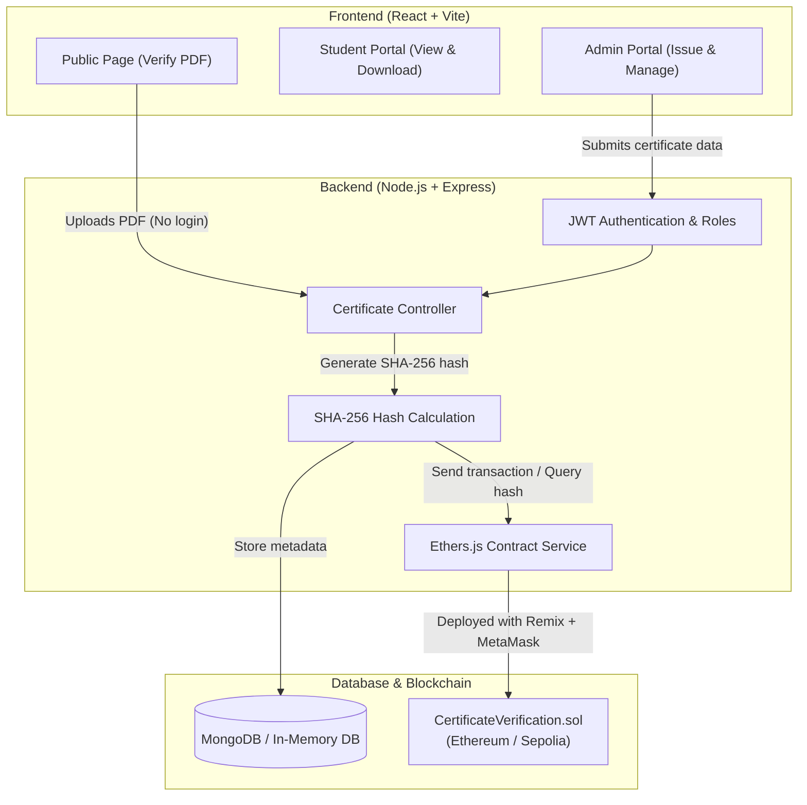

# Certify
### Blockchain-Based PDF Certificate Issuance and Verification System

**Live website:** [Certify](https://certify-authenticator-web3.vercel.app)

[](https://soliditylang.org/)
[](https://ethereum.org/)
[](https://remix.ethereum.org/)
[](https://metamask.io/)
[](https://nodejs.org/)
[](https://expressjs.com/)
[](https://react.dev/)
[](https://tailwindcss.com/)

Certify is a full-stack web application that allows educational institutions to issue certificates that cannot be altered or faked.

When an official certificate PDF is issued, the backend computes its unique SHA-256 digital fingerprint and saves that hash to a Solidity smart contract on the Ethereum blockchain (e.g. Sepolia testnet). Certificate metadata is indexed in MongoDB.

Anyone can verify the authenticity of a certificate by uploading the PDF file. The system checks the file hash directly against the blockchain. No login, password, or certificate ID is required to verify a document.

---

## Key Features

- **Direct Document Integrity Check**:
  - The system creates a unique SHA-256 hash from the binary content of the PDF file.
  - The 32-byte hash (`bytes32 documentHash`) is stored on the smart contract.
  - Modifying any character, date, or grade alters the file hash, which immediately causes verification to fail.

- **Instant Public Verification**:
  - Anyone can visit `/verify` and drop a certificate PDF to check its status.
  - Verification is done using the file itself without searching by ID or entering personal data.

- **Role-Based Access**:
  - **Admin / Institution**: Logs in to issue certificates, manage existing records, and download generated PDFs.
  - **Student**: Logs in to view their issued certificates and download the authentic PDF with a verification QR code.
  - **Public**: Has immediate access to the verification page.

- **PDF and QR Code Support**:
  - Automatically generates official certificate PDFs with an embedded QR code pointing to the verification page.

- **Built-in In-Memory Database Fallback**:
  - If a local MongoDB instance is not installed or running, the backend automatically launches an in-memory database server so you can test right away.

---

## How It Works



---

## Tech Stack

- **Smart Contract**: Solidity (`0.8.20`)
- **Deployment & Wallet**: Remix IDE, MetaMask (Ethereum Sepolia Testnet)
- **Web3 Library**: Ethers.js (`v6`)
- **Backend**: Node.js, Express.js, MongoDB (Mongoose), Multer, PDFKit, QRCode, JWT, bcryptjs
- **Frontend**: React 18, Vite, TailwindCSS, React Router v6, Axios, Lucide Icons

---

## Project Structure

```
blockchain-certificate-verification/
├── contracts/
│   └── CertificateVerification.sol   # Solidity Smart Contract
├── backend/
│   ├── config/
│   │   ├── db.js                     # MongoDB connection with in-memory fallback
│   │   ├── ethereum.js               # Ethers.js provider and contract setup
│   │   └── contractDetails.json      # Deployed contract address & ABI
│   ├── controllers/
│   │   ├── authController.js         # User registration and login
│   │   └── certificateController.js  # Certificate issuance, verification, PDF, QR
│   ├── middleware/                   # JWT auth, role validation, PDF upload checks
│   ├── models/                       # User and Certificate schemas
│   ├── routes/                       # Express routes (/api/auth, /api/certificates)
│   ├── services/                     # Cryptographic hashing & blockchain service
│   ├── server.js                     # Express server entry point
│   └── .env                          # Backend environment variables
├── frontend/
│   ├── src/
│   │   ├── components/               # Navbar, ProtectedRoute, UI elements
│   │   ├── pages/                    # Verify, Issue, Dashboard, CertificateList, Auth
│   │   ├── services/                 # Axios API service
│   │   └── App.jsx                   # Application routes
│   ├── tailwind.config.js            # Tailwind styling setup
│   └── vite.config.js                # Vite dev server and API proxy setup
└── README.md
```

---

## Setup and Installation

### Prerequisites
- Node.js (v18 or higher)
- npm
- MetaMask browser extension (with test ETH on Sepolia network)
- Web browser (to open Remix IDE)

---

### Step 1: Deploy Smart Contract with Remix IDE and MetaMask

1. Open [Remix IDE](https://remix.ethereum.org/).
2. Create a new file named `CertificateVerification.sol` under the `contracts/` folder in Remix.
3. Copy and paste the contract code from `contracts/CertificateVerification.sol` into Remix.
4. Go to the **Solidity Compiler** tab:
   - Select compiler version `0.8.20` (or compatible `^0.8.20`).
   - Click **Compile CertificateVerification.sol**.
5. Go to the **Deploy & Run Transactions** tab:
   - In the **Environment** dropdown, select **Injected Provider - MetaMask**.
   - Make sure your MetaMask wallet is connected and switched to the **Sepolia Testnet**.
   - Ensure your account has Sepolia test ETH (obtainable from a free Sepolia faucet).
   - Click **Deploy** and confirm the transaction in MetaMask.
6. After deployment completes:
   - Copy the **Deployed Contract Address**.
   - Go back to the compiler tab and click **ABI** to copy the contract ABI.
   - Update `backend/config/contractDetails.json`:
     ```json
     {
       "address": "YOUR_DEPLOYED_CONTRACT_ADDRESS",
       "network": "sepolia",
       "chainId": 11155111,
       "abi": [ ...YOUR_COPIED_ABI... ]
     }
     ```

---

### Step 2: Configure and Run Backend

1. Open a terminal and navigate to the `backend` folder:
   ```bash
   cd backend
   npm install
   ```

2. Open or create `backend/.env` and update your settings:
   ```env
   PORT=5000
   NODE_ENV=development
   JWT_SECRET=your_secret_jwt_key
   MONGO_URI=mongodb://127.0.0.1:27017/blockchain_certificate_db
   RPC_URL=https://ethereum-sepolia-rpc.publicnode.com
   ISSUER_PRIVATE_KEY=your_metamask_private_key_or_issuer_key
   CONTRACT_ADDRESS=your_deployed_contract_address
   ```
   *Notes:*
   - You can export the private key of your deployer/issuer account from MetaMask (**Account Details -> Show Private Key**). Keep this key safe and do not share it.
   - If local MongoDB is not running on your computer, the backend will automatically start an in-memory database instance so you can continue testing immediately.

3. Start the backend:
   ```bash
   npm run dev
   ```
   The backend will start on `http://localhost:5000`.

---

### Step 3: Run Frontend

1. Open a new terminal and navigate to the `frontend` folder:
   ```bash
   cd frontend
   npm install
   ```

2. Start the Vite development server:
   ```bash
   npm run dev
   ```
   The frontend will run on `http://localhost:5173`.

---

## How to Test the Application

1. **Public Verification**:
   - Open `http://localhost:5173/verify`.
   - Upload any valid certificate PDF file.
   - The backend computes the SHA-256 hash and checks it against the smart contract.
   - The screen displays the student name, course, institution, issue date, and confirmation that the document is authentic.

2. **Issue a Certificate (Admin)**:
   - Register or log in with an Admin account (`Role: Admin`).
   - Go to `/issue`.
   - Enter student details and course information.
   - Submit the form. The backend generates the PDF with an embedded verification QR code, records the SHA-256 hash onto the blockchain, and saves the metadata.

3. **Tamper Test**:
   - Open a valid certificate PDF in any PDF or text editor.
   - Change a single letter, date, or name.
   - Save the file and upload it to `http://localhost:5173/verify`.
   - Because the hash no longer matches the blockchain record, the system will flag the certificate as invalid or tampered.

---

## Security Notes

- **Cryptographic Hashing**: SHA-256 guarantees that even the slightest alteration to a PDF produces a completely different hash.
- **Gas Efficiency**: Only the 32-byte hash (`bytes32`) and essential metadata are stored on-chain, keeping transaction costs low.
- **Access Control**: Certificate issuance and revocation actions are protected by JWT authentication and role authorization checks on the backend, alongside smart contract ownership controls.
